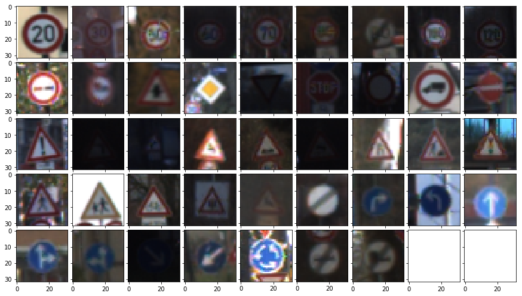
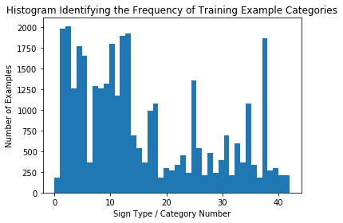
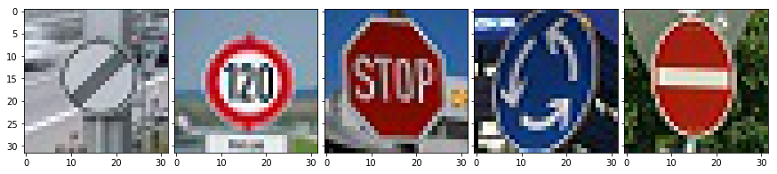

# **Traffic Sign Classification** 

---

## Project Goals

The goals of this project are the following:
* Load the data set
* Explore, summarize and visualize the data set
* Design, train and test a model architecture
* Use the model to make predictions on new images
* Analyze the softmax probabilities of the new images

---
## Writeup and Overview

### Data Set Summary

The following information was ascertained using basic numpy functions

* Number of training examples = 34799
* Number of testing examples = 12630
* Image data shape = (32, 32, 3)
* Number of classes = 43

### Data Set Visualization

Here is an exploratory visualization of the data set. Below is a sample image from each of the 43 categories.



Some of these categories were more represented than others. The histogram below outlines that some categories do not have enough training examples.



### Data Preprocessing

Firstly, all of the images were converted into grayscale. This is because the main feature that differentiates road signs are the text and shapes of the items on it. The colour is fairly similar between all of them, and was thus not a major tool to classify them. Turning each image from 3 channels to 1 also speeds up the computational complexity.

The next step was to normalise the pixel intensity values within the grayscale image. Instead of the intensity of the single channel ranging from 0 to 255, it was adjusted to range from -1 to 1, with a mean of 0.

#### Convolutional Neural Network Architecture

My final model consisted of the following layers:

| Layer         		|     Description	        					| 
|:---------------------:|:---------------------------------------------:| 
| Input         		| 32x32x1 Grayscale image   							| 
| Convolution 5x5     	| 1x1 stride, valid padding, outputs 28x28x6 	|
| RELU					|												|
| Max pooling 2x2     	| 2x2 stride,  outputs 14x14x6 				|
| Convolution 5x5	    | 1x1 stride, valid padding, outputs 10x10x16			|
| RELU					|												|
| Max pooling 2x2     	| 2x2 stride,  outputs 5x5x6 				|
| Fully connected		| 400 Input, 120 Output   									|
| RELU					|												|
| Dropout    | 0.85 Keep Probability   |
| Fully connected		| 120 Input, 84 Output   									|
| RELU					|												|
| Dropout    | 0.85 Keep Probability   |
| Fully connected		| 84 Input, 43 Output   									|
| RELU					|												|
| Softmax				| etc.        									|
 
#### Model Parameters

After large amounts of training, the hyperparameters were selected as per below. The learning rate was increased from the recommended 0.001 to 0.002. With no effect on stability, this decreased the number of epochs required for convergence. The epoch size was also selected to ensure convergence.

```
EPOCHS = 20
BATCH_SIZE = 250
RATE = 0.002
KEEP_PROB = 0.85
```

The Adam optimiser was used to minimise the cost function. This optimiser is more sophisticated than stochastic gradient decent, computing the result in less time, and is less susceptible to instability and/or local minima. Consequently it was selected as a good fit for this project.

#### Architecture Reflection
The architecture that was utilised above is a variation of the well-known LeNet architecture.

I started off with a classical LeNet structure, and achieving a validation accuracy of approximately 85%. However, I noticed that the training set accuracy was nearly 100%. This indicated to me that the network was overfitting the data, and could not identify new datasets very well. Consequently, dropout layers were added on both fully connected layers to mitigate against this.

As a result of this change, the training required more epochs, but it resulted in a far more consistent result between the validation accuracy and the training accuracy.

Overall, the LeNet convolution neural network architecture was chosen because it is well proven in basic bounded image classification problems. Being a convolutional network, it also reduces computational complexity as a result of weight sharing, and uses the inherent properties of adjacent pixels to improve the model. This enabled a high accuracy to be achieved.

My final model results were:
* Training set accuracy of 0.992
* Validation set accuracy of 0.937 
* Test set accuracy of 0.917

The consistent results between the three sets indicates no under/overfitting is now occuring. The high accuracy also indicates that the model is very appropriat for the situation

## Testing the Model on New Images

### Selected Images from the Internet

Here are five German traffic signs that I found on the web:



These images are all fairly straight forward, aside from the 4th one. The top and bottom of this road sign is partially clipped off, and may pose a challenge for the neural network. Since it has been trained on images with well defined bounds on the signs within each image, it may struggle when these well-defined bounds are not applied.

### Predictions

Here are the results of the prediction:

| Image			        |     Prediction	        					| 
|:---------------------:|:---------------------------------------------:| 
| No Speed Limit      		| No Speed Limit   									| 
| 120 Speed Limit     			| 120 Speed Limit 										|
| Stop					| Stop											|
| Roundabout	      		| Roundabout				 				|
| No Entry			| No Entry      							|


The model was able to correctly guess 5 of the 5 traffic signs, which gives an accuracy of 100%. Even the difficult image of the roundabout was able to be correctly identified.

### Prediction Certainty

The predictions were made in the second last cell of the python notebook.

For all of the images, aside from the fourth one, the probabilities determined from the softmax function were extremely high (above 90%). These are presented below.

| Probability         	|     Prediction	        					| 
|:---------------------:|:---------------------------------------------:| 
| .999         			| No Speed Limit    									| 
| .999     				| 120 Speed Limit										|
| .948					| Stop											|
| .658	      			| Roundabout					 				|
| .999				    | No Entry    							|

---
## Improvements
The next step to improve this model is to determine which kinds of images are being misclassified. Most likely, the signs with low amounts of training data are likely causing issues. As a result, the images of these signs can be augmented with new images, or by altering them in some way. For instance, one approach would be to use Gaussian or Salt-and-Pepper noise to the images. Additionaly, they could be rotated.

Another improvement to the network could be to bypass a layer, as mentioned in LeCun's paper. Concatenating the final connected layer with information directly out of the second convolution would allow the network to learn from the raw parameters in the convolution, as well as from the processed information in the fully connected layers.


